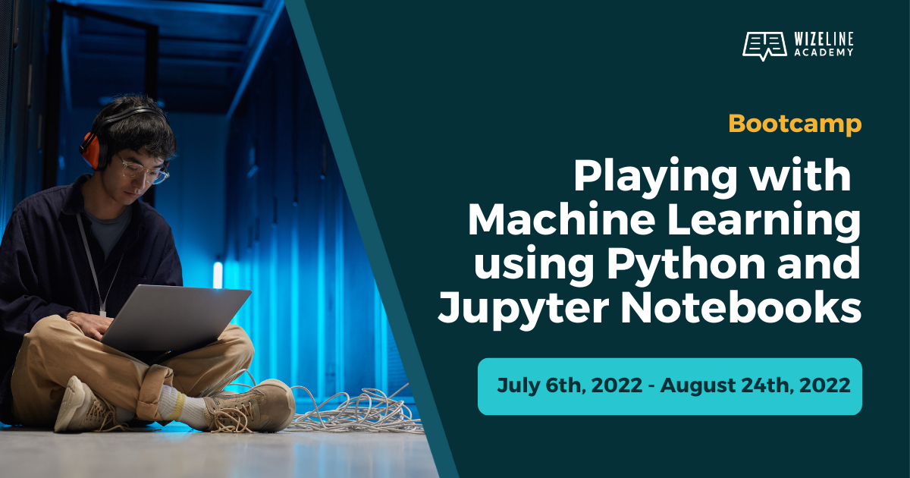

# Session 12

## Machine Learning in the Cloud

## Today's Notebook

[Today's Jupyter Notebook](./cloud.ipynb)

## Feedback

Please helps us filling up the **[Feedback Form](https://docs.google.com/forms/d/e/1FAIpQLSf-yrrCkg66KFFimIk62me8jkSybb9wY1tdqhuRNKG1pchk5w/viewform)**.

## We did it

Congratulations, you got to the end of the course.

## Capstone Project

Finish it up! You have until Wednesday, August 24th.

1. Fork the [Capstone Template](https://github.com/WizelineIntroToPythonML/capstone) into you GitHub Account.
2. Clone it into your computer.
3. Finish it up! It should be very similar to the work we did in the [Machine Learning Notebook](https://github.com/WizelineIntroToPythonML/11-machinelearning).
4. Push it back to the GitHub repository.

Remember, you can always ask for help in the `#playingwml-bootcamp` Slack channel.

## Thank you very much
